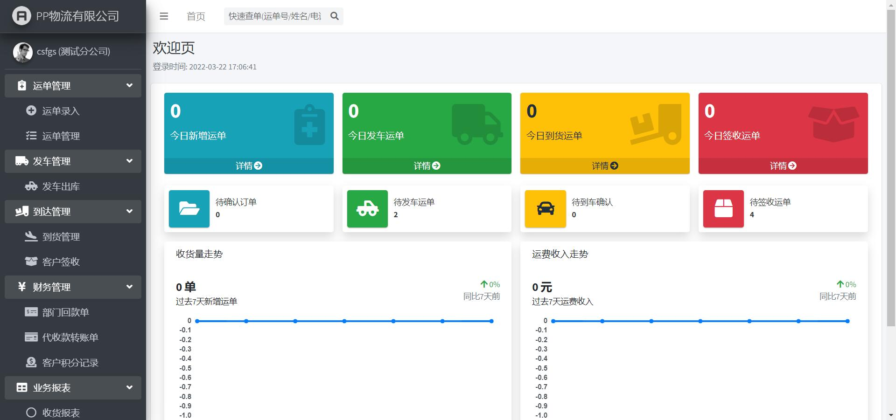
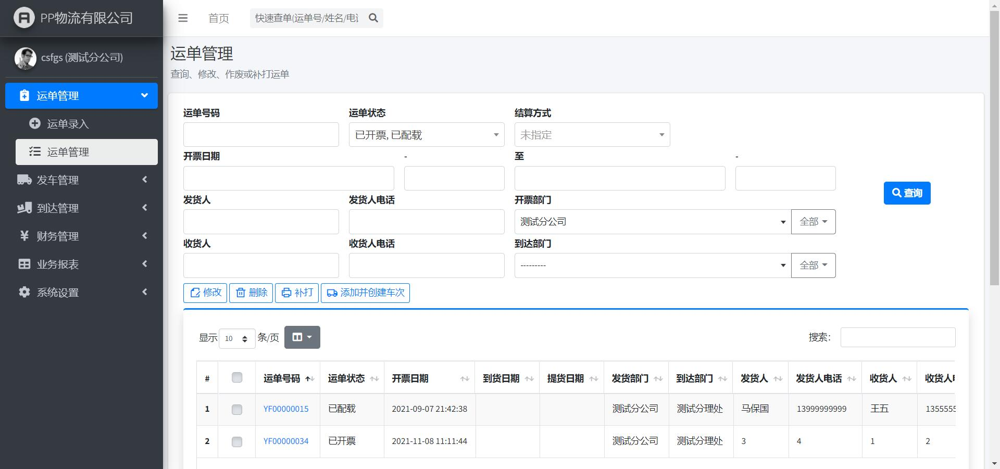
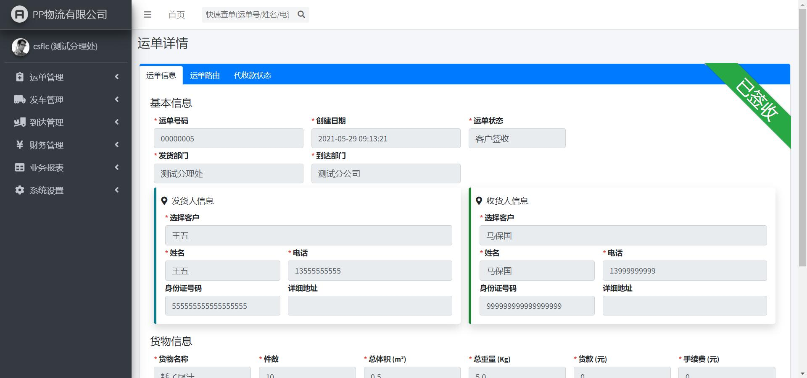
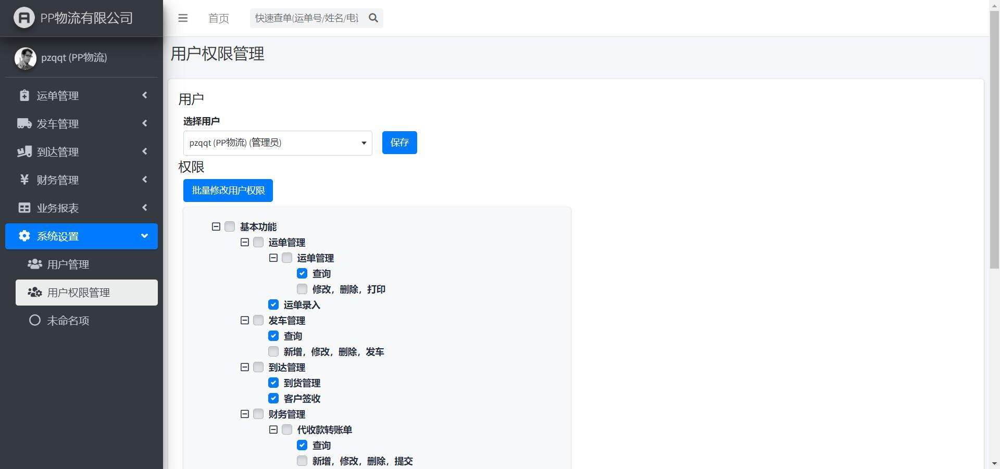
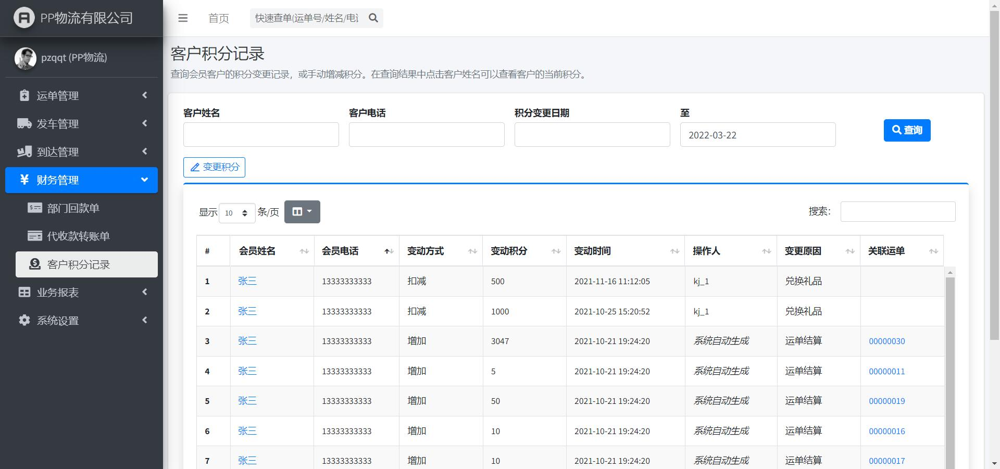

# Django_Transportation_Management_System
基于Django实现的物流管理系统（TMS，Transportation Management System）

前几年工作时忙里偷闲写的练手项目。

## 特点

- 前端基于Bootstrap 4框架和AdminLTE框架。
- 使用MySQL作为数据库后端。
- 实现了运单录入、发车出库、到货签收、客户签收等基本功能。
- 拥有较为完善的报表功能和财务管理功能。
- 可以通过后台界面对各个用户进行权限管理。

## 缺陷

- 由于没有认清时代潮流，所以没有做前后端分离，~~本来是打算当作跳槽的敲门砖的，淦！~~。
- 由于前期纯粹是抱着练手的目的写的，边学边做，所以没有保留历史提交，~~但保留了上百个历史版本的备份~~。
- 由于知识匮乏，所以重复造了很多轮子。
- 由于没有时间~~太懒~~，所以没有编写使用文档。

## TODO

- 实现打印货物标签和提货单的功能。（需要配合打印控件）
- 实现消息功能。

## 依赖

- 必要的第三方库
  - django
  - mysqlclient
  - openpyxl （用于实现报表导出功能）
- 可选的第三方库
  - django-debug-toolbar （用于调试）
  - django-extensions （用于增强`manage.py`的功能）

## 预览

